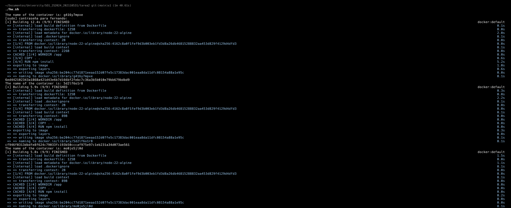
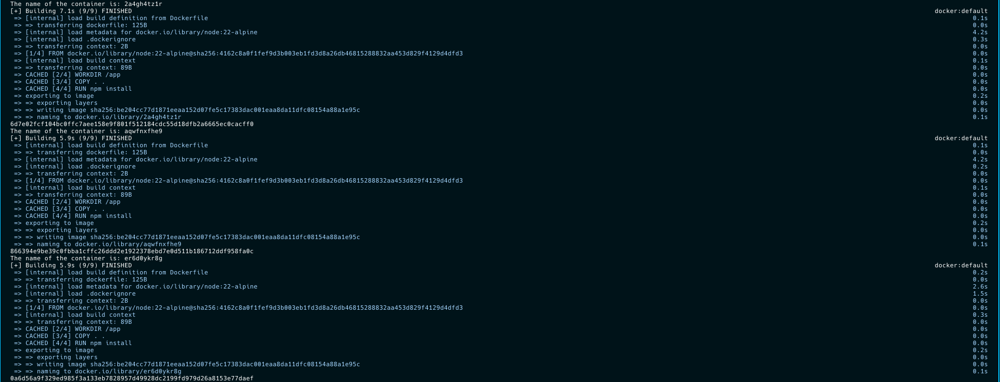
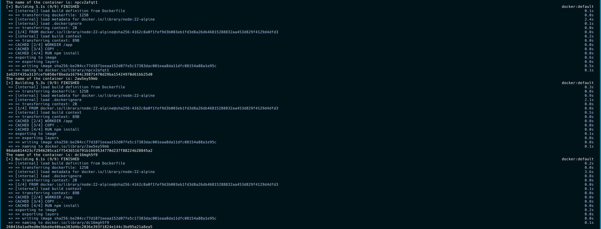
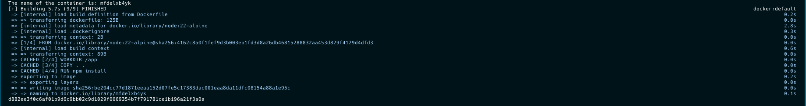
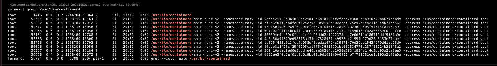

# TAREA 2

Enrique Fernando Gaitán Ibarra
202110531

### Bash File
```bash
#!/bin/bash

# For loop to create 10 containers
for i in {1..10}; do
    # Get the path of the Dockerfile
    path=$(pwd)/app

    # Generate a random name
    name=$(cat /dev/urandom | tr -dc 'a-z0-9' | fold -w 10 | head -n 1)
    echo "The name of the container is: $name"

    # Build the image
    sudo docker build -t $name $path

    # Check if the image was created
    if [ $? -ne 0 ]; then
      echo "Error creating the image"
      exit 1
    fi

    # Run the container
    sudo docker run -d --name $name $name
done
```

### Containers Images





### Containers Filter "ps aux"
